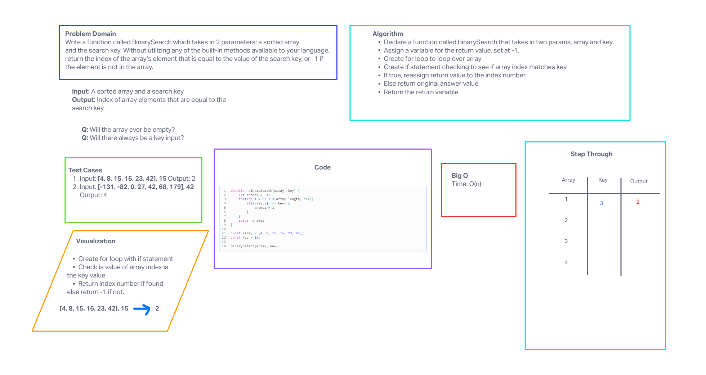

# Array Binary Search
<!-- Description of the challenge -->

Write a function called BinarySearch which takes in 2 parameters: a sorted array and the search key. Without utilizing any of the built-in methods available to your language, return the index of the array’s element that is equal to the value of the search key, or -1 if the element is not in the array.

## Whiteboard Process
<!-- Embedded whiteboard image -->

## Approach & Efficiency
<!-- What approach did you take? Why? What is the Big O space/time for this approach? -->

Our approach was breaking down the problem into smaller steps, we knew that we had to split the array in two somehow and insert an number in the middle of it the tough part was knowing what to do without methods.

## Solution
<!-- Show how to run your code, and examples of it in action -->

