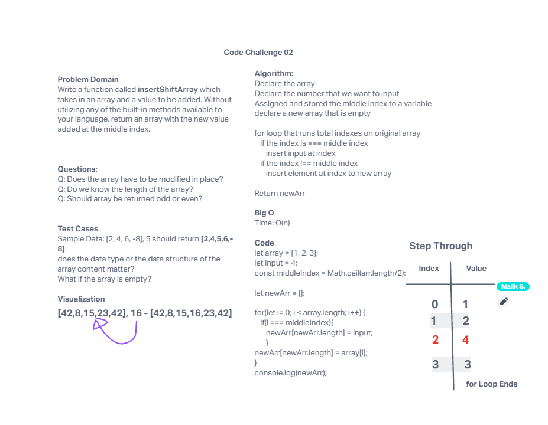

# Array Reverse
<!-- Description of the challenge -->

Write a function called insertShiftArray which takes in an array and a value to be added. Without utilizing any of the built-in methods available to your language, return an array with the new value added at the middle index.

## Whiteboard Process
<!-- Embedded whiteboard image -->

## Approach & Efficiency
<!-- What approach did you take? Why? What is the Big O space/time for this approach? -->

Our approach was breaking down the problem into smaller steps, we knew that we had to split the array in two somehow and insert an number in the middle of it the tough part was knowing what to do without methods.

## Solution
<!-- Show how to run your code, and examples of it in action -->

