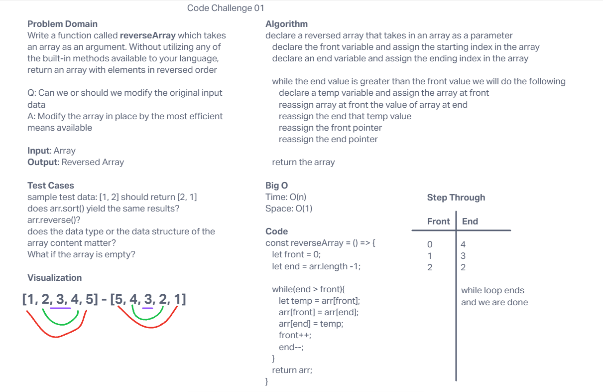
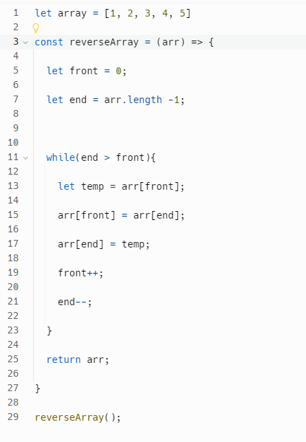

# Array Reverse
<!-- Description of the challenge -->

Write a function called reverseArray which takes an array as an argument. Without utilizing any of the built-in methods available to your language, return an array with elements in reversed order.

## Whiteboard Process
<!-- Embedded whiteboard image -->

## Approach & Efficiency
<!-- What approach did you take? Why? What is the Big O space/time for this approach? -->

My approach today was following along in class I did not copy and paste but I did follow along with Ryan but this is his code

## Solution
<!-- Show how to run your code, and examples of it in action -->

