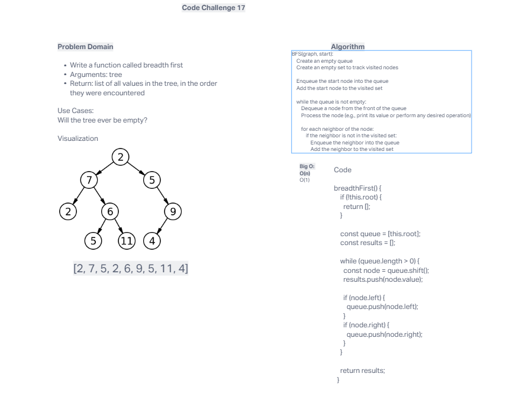
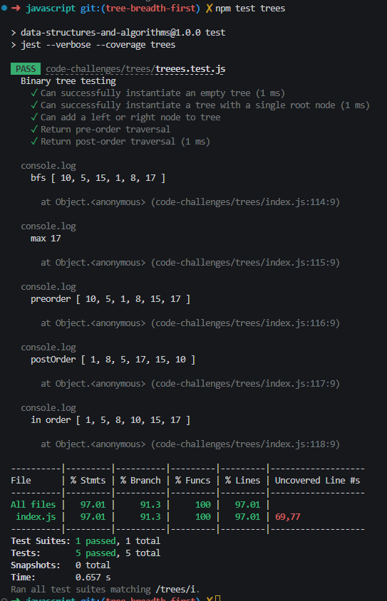

# Trees

## Whiteboard Process

## Approach and Efficiency

Break down the problem and reflect on what we learned friday and imppliment code that worked for this situation and problem

## Solution

